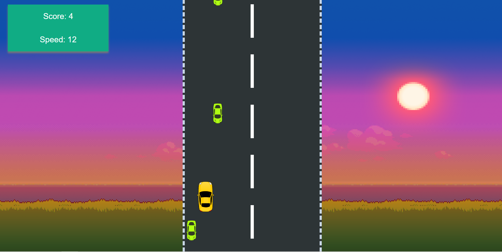

<pre>
Deploy Link(Only Works Best in Desktop) : - <a href = "https://daxoron.github.io/CarGame">Click Here</a>
</pre>
Screenshot:

GitHub Repository: <a href="https://github.com/daxoron/CarGame"><i class="large github icon "></i>Car Game</a>
