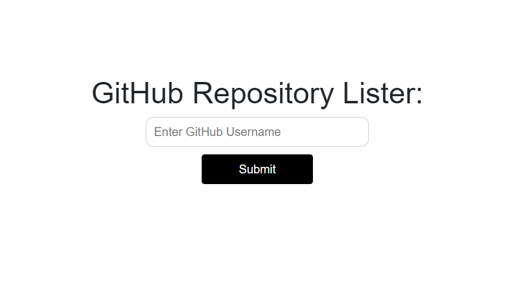

<pre>
Deploy Link : - <a href = "https://github-repo-lister.netlify.app/">Click Here</a>

Screenshot#1:

</pre>

GitHub Repository: <a href="https://github.com/daxoron/GitHubRepoLister"><i class="large github icon "></i>Github Repository Lister</a>
