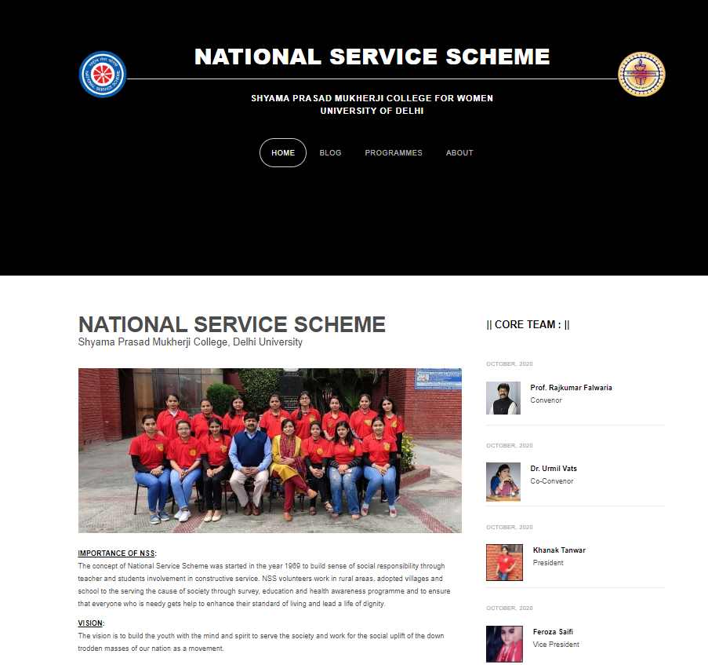

<pre>
Deploy Link : - <a href = "https://daxoron.github.io/NSSWebsite">Click Here</a>
</pre>
Screenshot:

GitHub Repository: <a href="https://github.com/daxoron/NSSWebsite"><i class="large github icon "></i>NSS Website - Blogs and Events</a>
