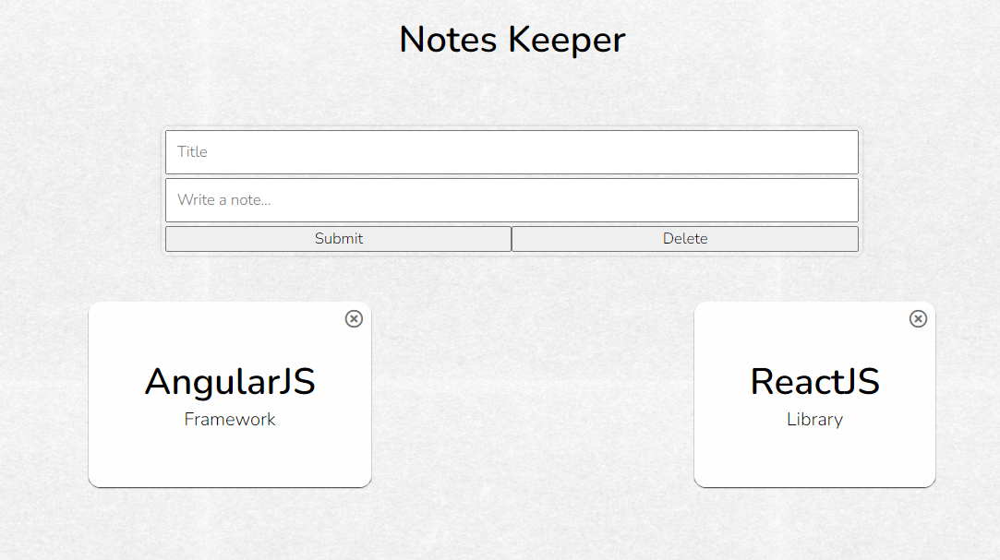

<pre>
Deploy Link : - <a href = "https://daxoron.github.io/NoteKeeper">Click Here</a>

Screenshot:

</pre>

GitHub Repository: <a href="https://github.com/daxoron/NoteKeeper"><i class="large github icon "></i>Note Keeper</a>
